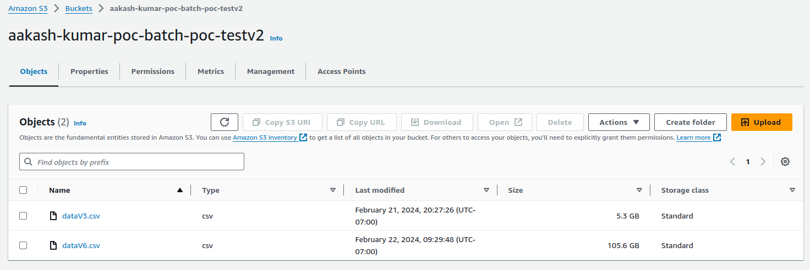
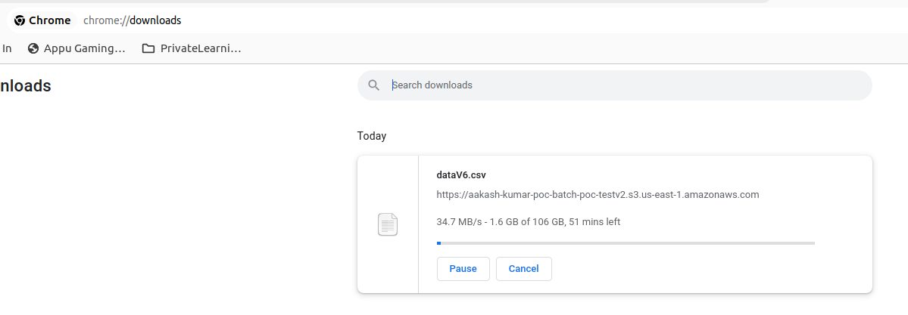

# INFRA SETUP
## AWS S3

## SPARK BATCH PROGRAM

> NOTE: AWS S3 & Spark Batch Program are into different regions as shown in the above snapshots. 

 
 
 

# PERFORMANCE METRICS

## Regular Download
When the AWS S3 file is downloaded using a regular approach via. the browser with the same machine where the 'Spark Batch Program' is running it takes "50 mins+" to download the file (105 GB).

 

## Spark Batch Program Download
While if the AWS S3 files are downloaded by using the Spark Cluster then it takes only "2.8 minutes" to down both the files (110 GB)

In the below Spark Batch program, various spark and aws s3 optimizing arguments are passed to get the best performance.  
[Spark Batch Program](programs/download_filesv2.py)

